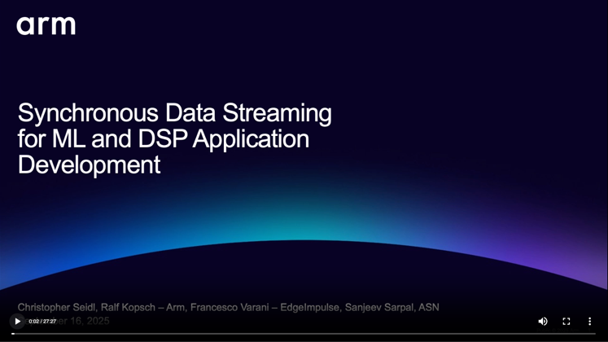

# SDS-Examples

This repository contains examples that show the usage of the [Synchronous Data Streaming (SDS) Framework](https://github.com/ARM-software/SDS-Framework).

## Quick Start

1. Install [Keil Studio for VS Code](https://marketplace.visualstudio.com/items?itemName=Arm.keil-studio-pack) from the
   VS Code marketplace.
2. Clone this Git repository into a VS Code workspace.
3. Open the [CMSIS View](https://mdk-packs.github.io/vscode-cmsis-solution-docs/userinterface.html#2-main-area-of-the-cmsis-view)
   in VS Code and use the ... menu to choose an example via *Select Active Solution from workspace*.
4. The related tools and software packs are downloaded and installed. Review progress with *View - Output - CMSIS Solution*.
5. In the CMSIS view, use the
   [Action buttons](https://github.com/ARM-software/vscode-cmsis-csolution?tab=readme-ov-file#action-buttons) to build,
   load and debug the example on the hardware.

## Examples description

The SDS examples are configured for various Evaluation Boards and use the [MDK-Middleware](https://www.keil.arm.com/packs/mdk-middleware-keil/overview/) for the [SDSIO Interface](https://arm-software.github.io/SDS-Framework/main/sdsio.html). New hardware targets can be added using board layers that provide the required API interfaces.
The examples are configured for [Keil Studio for VS Code](https://www.keil.arm.com/).
Run a blinky example for the related board first to verify tool installation.
> IMPORTANT
>
> - Each example has a local VS Code configuration. Use in VS Code **Open Folder** to open the folder of each project individually.

| Example name                                               | Description   |
|---                                                         |---            |
| [Alif/AppKit](./Alif/AppKit/SDS.csolution.yml)             | [SDS Application on Alif AppKit board with SDSIO using USB interface](./Alif/AppKit/README.md). [Alif AppKit board](https://www.keil.arm.com/boards/alif-semiconductor-appkit-e7-aiml-gen-2-140e28d/guide/)              |
| [Alif/DevKit](./Alif/DevKit/SDS.csolution.yml)             | [SDS Application on Alif DevKit board with SDSIO using Ethernet interface](./Alif/DevKit/README.md). [Alif DevKit board](https://www.keil.arm.com/boards/alif-semiconductor-devkit-e7-gen-2-92ef25f/guide/) |
| [ST/B-U585I-IOT02A](./ST/B-U585I-IOT02A/SDS.csolution.yml) | [SDS application on STMicroelectronics B-U585I-IOT02A board with SDSIO using the USB interface](./ST/B-U585I-IOT02A/README.md). [STMicroelectronics B-U585I-IOT02A board](https://www.keil.arm.com/boards/stmicroelectronics-b-u585i-iot02a-revc-c3bc599/features/) |

## Directory Structure

| File/Directory                            | Content |
|---                                        |--- |
| [.ci](./.ci)                              | Files that are related to the Continuous Integration (CI) tests. |
| [.github/workflows](./.github/workflows)  | [GitHub Actions](#github-actions) scripts for build and execution tests. |
| [Alif/AppKit](./Alif/AppKit)              | SDS Framework deployed to Alif AppKit using USB communication. |
| [Alif/DevKit](./Alif/DevKit)              | SDS Framework deployed to Alif DevKit using Ethernet communication. |
| [ST/B-U585I-IOT02A](./ST/B-U585I-IOT02A)  | SDS Framework deployed to [ST B-U585I-IOT02A](https://www.keil.arm.com/boards/stmicroelectronics-b-u585i-iot02a-revc-c3bc599) using USB communication. |
| [Jupyter](./Jupyter)                      | Display SDS data files using a Jupyter notebook. |

## Webinar

The following webinar shows how to use the SDS framework and the examples in this repository:

## Continuous Integration (CI)

The repository uses [GitHub Actions](.github/workflows) to test project build with AC6 and GCC and execute algorithm tests.
Refer to [Understanding GitHub Actions](https://docs.github.com/en/actions/get-started/understand-github-actions) and [Arm FVPs](https://arm-software.github.io/AVH/main/infrastructure/html/avh_gh_actions.html) documentation for more information.

| 
 CI Workflow 
                  | Description |
|---                                                            |---  |
| [AC6_test_build](./.github/workflows/AC6_test_build.yaml)     | Use Arm Compiler for Embedded (AC6) to create binaries for different configuration of targets, build types, and boards. After successful generation these are stored as artifacts. |
| [GCC_test_build](./.github/workflows/GCC_test_build.yaml)     | Use GCC build tools to create binaries for different configuration of targets, build types, and boards. After successful generation these are stored as artifacts. |
| [AlgorithmTest_ST_B-U585I-IOT02A](./.github/workflows/AlgorithmTest_ST_B-U585I-IOT02A.yaml)  | Build the binary of a Motion Recognition ML algorithm and execute a regression test by using an FVP model and prerecorded SDS files. Regressions are stored as artifacts. |

## Issues or Questions

Raise questions or issues for these examples on the repository [github.com/ARM-software/SDS-Framework](https://github.com/ARM-software/SDS-Framework/tree/main?tab=readme-ov-file#issues-and-labels).
